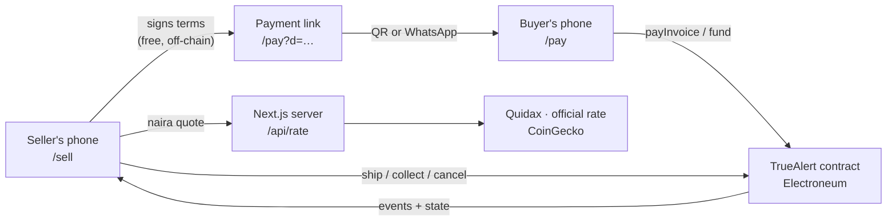
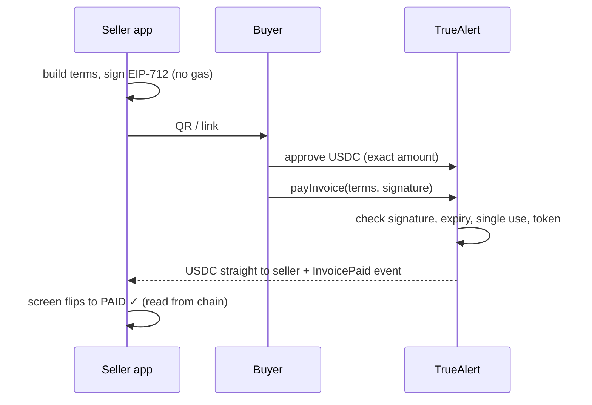
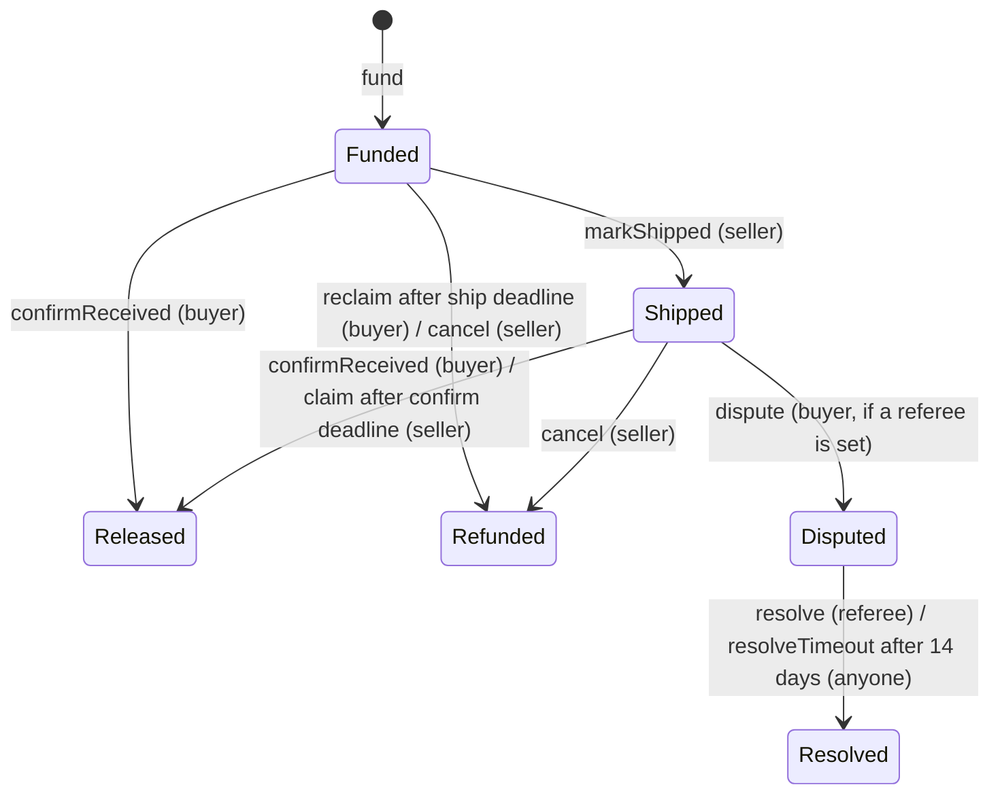

# Architecture

How TrueAlert works, and why it's built this way. To run it, see [SETUP.md](SETUP.md).

## The system at a glance

There are three parts:

- **The contract** (`contracts/src/TrueAlert.sol`) holds the rules and, for escrow orders, the money.
- **The web app** (`app/`) lets sellers create and sign sales, and lets buyers verify and pay them.
- **Payment links** carry everything between the two, so no database is needed today.

**Design principle:** the contract holds the money and enforces the rules; everything else is convenience. If the website disappeared, every buyer and seller could still release, refund or collect by calling the contract directly.

## Payment modes

| | Pay now | Protected |
| --- | --- | --- |
| Use | In person (stall, kiosk) | Remote (WhatsApp, Instagram DMs) |
| Money moves | Buyer → seller instantly | Buyer → escrow → seller on delivery |
| Contract holds funds | Never | Until release or refund |
| Link lifetime | 15 minutes (keeps the naira rate fresh) | 48 hours |
| Fee | Never | Configurable, capped at 2% (currently 0%) |

### Pay now

### Protected: the escrow state machine

Timeouts cover both sides, so money can never be stuck:

- **The seller never ships:** after the ship deadline, the buyer reclaims in full.
- **The buyer goes silent:** after the confirm deadline, the seller collects.
- **The parcel is late:** the buyer can extend the confirm deadline once, by up to 48 hours.
- **Something's wrong:** the buyer disputes to the referee named in the terms. If the referee doesn't rule within 14 days, anyone can trigger a full refund to the buyer.

| Limit | Value | Why |
| --- | --- | --- |
| Ship window | 1 hour – 14 days | seller-chosen, e.g. "Same day / Lagos" 24h, "Interstate" 3 days |
| Confirm window | 12 hours – 14 days | the 12h floor stops a seller marking shipped and claiming before the buyer can react |
| Extension | once, ≤ 48 hours | for slow deliveries, without letting a buyer stall forever |
| Referee deadline | 14 days | after it, the buyer gets a full refund |

## Signed terms

Sellers never pay gas to create a sale. They sign **terms** off-chain with EIP-712, and the buyer submits the terms plus the signature when paying. The contract checks the signature came from the seller.

| Field | Meaning |
| --- | --- |
| `id` | random 32 bytes; also the replay guard, since each ID can be paid or funded once |
| `mode` | Pay now or Protected |
| `seller` | who gets paid; must be the signer (EOAs and ERC-1271 smart wallets both work) |
| `token`, `amount` | exact amount in token units (ETN or an allowlisted ERC-20) |
| `expiry` | last moment the link can be paid |
| `buyer` | zero address for an open link, or one wallet that alone may pay |
| `shipWindow`, `confirmWindow`, `arbiter` | Protected orders only |
| `ref` | hash of the order details (items, naira price, rate) |

The EIP-712 domain includes the chain ID and contract address, so a signature can't be replayed on another chain or deployment.

## Payment links

A link is `/pay?d=<base64url>`. It carries the terms, the signature and the order details, in a compact positional JSON encoding (`app/src/lib/link.ts`).

**`ref` is not sent.** The buyer page recomputes it from the details it displays, then asks the contract `isValidSellerSignature(terms, signature)`. So:

- If anyone edits the price, an item or a quantity, `ref` changes, the signature no longer matches, and the page leads with **"Not signed by the seller. Don't pay"** over a greyed-out card.
- Decoding is strict: unknown fields, over-long text and malformed numbers are rejected.
- A **multi-item** sale carries its breakdown (name, quantity, unit price). The link is rejected unless the lines add up exactly to the signed naira total; sums are done in kobo, so there's no floating-point drift.

Links need no backend. The tradeoff is length: about 1,000 characters, which makes the pay-now QR dense. Short links (planned) will fix that.

## Pricing

Sellers think in naira; the chain settles in tokens.

1. **Rate:** `GET /api/rate` (`app/src/lib/server/rates.ts`) returns the midpoint of Quidax's live USDT/NGN order book: what stablecoins actually trade for in naira. If Quidax fails, it reuses a Quidax rate up to 5 minutes old, then falls back to the daily official rate. ETN/USD comes from CoinGecko, with a price up to 10 minutes old reused when it rate-limits.
2. **Cache:** the server caches for 60 seconds, and concurrent requests share one upstream fetch. The `/sell` page renders with the rate already included, so the form can price a sale on first paint.
3. **Quote:** the token amount is rounded **up** to 0.01, so the buyer pays exactly what's shown and the seller never receives less than the naira price.
4. **Lock:** the rate and its source and time are written into the signed details. Later rate moves don't affect a created sale.

For local development, `RATE_FIXED_NGN_PER_USD` pins the rate so things work offline.

## Time

The contract judges deadlines by **block time**. The app uses the later of the device clock and the latest block timestamp when it computes expiry and deadlines. A phone with a slow clock can't then create links that are already expired, or offer an action the contract would reject as too early.

## The web app

| Route | Purpose |
| --- | --- |
| `/` | home: routes sellers and buyers |
| `/sell` | create a sale, show its QR or share link, watch payment land, recent sales |
| `/pay` | verify and pay a link; manage a Protected order (buyer or seller, whoever is connected) |
| `/api/rate` | naira rate service |

| Where | What |
| --- | --- |
| `app/src/lib/` | pure logic, unit-tested: link encoding, EIP-712 terms, sale building and quoting, invoice and order state, errors, formatting |
| `app/src/hooks/` | chain state (`useInvoice`, `useSaleStatus`), transactions (`useContractTx` simulates before the wallet opens, so reverts become plain messages), balances, clocks |
| `app/src/components/` | the screens, built on shared primitives (`Shell`, `Card`, `Button`, `Field`, `Badge`, `Notice`) |
| `app/src/config/` | chains (Electroneum testnet is defined here; viem's built-in entry has a dead RPC), environment, allowlisted tokens, wallets |

UI details that matter on real phones:

- Only allowlisted tokens are ever shown; on-chain token names are never rendered, because testnet has spoofed ones.
- Irreversible actions (releasing or refunding money) need two taps.
- USDC approvals are for the exact invoice amount, never unlimited.
- Colours are semantic tokens with a dark theme, tap targets are at least 44px, and QR codes stay dark-on-white in dark mode for scanners.

## Security model

- **The owner can:** allowlist tokens, pause **new** invoices and orders, and set a fee of at most 2%. The fee is snapshotted per order when funded, and waived if no fee recipient is set.
- **The owner can't:** move funds, block releases, refunds or claims, resolve disputes, change a funded order's fee, or upgrade the contract. There is no proxy.
- **A referee can** only split a disputed order's money between that order's buyer and seller.
- **Protections:** re-entrancy guards with state changes before transfers, exact amounts only, single-use IDs, signatures bound to chain and contract, an allowlist to exclude fee-on-transfer and rebasing tokens.

### How it's tested

| Suite | Count | What it proves |
| --- | --- | --- |
| Contract unit + fuzz | 134 | every state transition, every forbidden one, deadline boundaries to the second, fee maths |
| Contract invariant | 3 | across random sequences of every action, the contract's balance always equals the funds of open orders |
| Re-entrancy | 2 | a malicious ETN-receiving seller can't double-spend |
| App unit | 98 | link encoding and tamper detection, EIP-712, quoting and rounding, order state, rate fallbacks |
| End-to-end | 16 | real browser, real transactions: pay now, escrow, ship, confirm, extend, dispute, refunds, multi-item |

`forge coverage` reports 100% of lines and functions in `TrueAlert.sol`, and 98% of branches.

## Electroneum specifics

- **EVM level:** Electroneum supports opcodes up to London. Contracts compile for `paris`; anything newer fails to deploy with `invalid opcode: PUSH0`. The local chain runs `anvil --hardfork london` to match.
- **Gas:** Foundry's EIP-1559 estimate comes out far below the ~1 gwei network price, so deploys use `--legacy`. The app's wallet transactions estimate correctly.
- **Stablecoins:** mainnet has Hyperlane-bridged USDC and USDT, with thin liquidity (about $6k each at the time of writing). Testnet has no canonical stablecoin, so TrueAlert deploys its own `MockUSDC` (6 decimals, like mainnet USDC).
- **Wallets:** MetaMask, Rabby, Trust (manual network) and Zypto (ETN built in) support the chain.

## Key decisions

| Decision | Why | Tradeoff |
| --- | --- | --- |
| Sellers sign off-chain | no gas and no wallet pop-up to create a sale at a stall | links are long |
| Self-contained links | works with no backend; the contract is the source of truth | dense QR until short links exist |
| Price in naira, settle in stablecoins | sellers think in naira; escrow shouldn't carry ETN price risk | depends on a live rate source |
| Round token amounts up | the seller never gets less than the naira price | the buyer may pay up to 0.01 more |
| Two-way timeouts, optional referee | no one can hold the other's money hostage | a dishonest "shipped" needs a referee to catch |
| Non-upgradeable contract | nothing can change the rules under funded orders | fixes need a new deployment |
